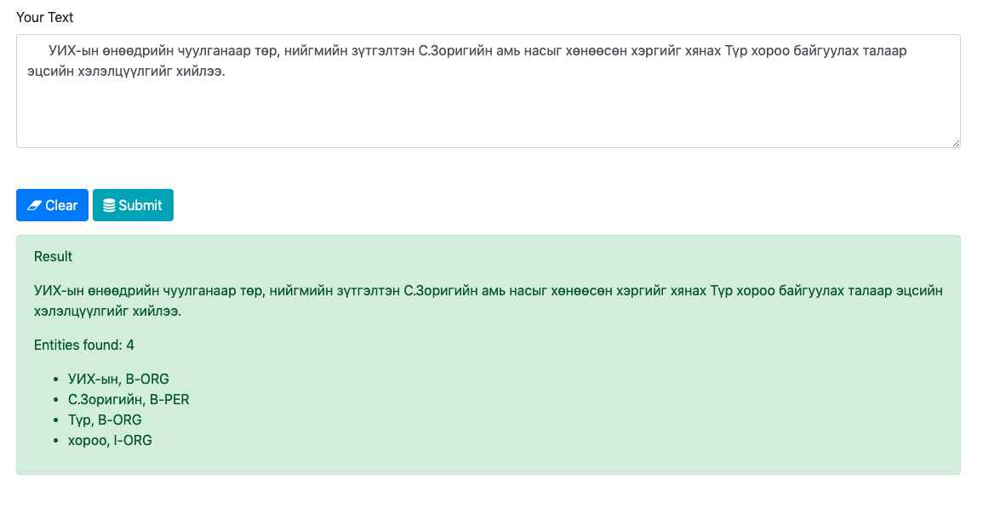

# BERT NER

Use [Mongolian pre-trained BERT](https://github.com/tugstugi/mongolian-bert) for finetuning [NER](https://en.wikipedia.org/wiki/Named-entity_recognition) task on [Mongolian NER dataset](https://github.com/tugstugi/mongolian-nlp/blob/master/datasets/NER_v1.0.json.gz)


# Requirements
First download pre-trained cased BERT-Base model from [here](https://drive.google.com/file/d/11Adpo6DorPgpE8z1lL6rvZAMHLEfnJwv)

-  `python3`
- `pip3 install -r requirements.txt`

# Run

`python run_ner.py --data_dir=data/ --bert_model=bert-base-cased --task_name=ner --output_dir=out --max_seq_length=50 --do_train --num_train_epochs 5 --do_eval --do_test --warmup_proportion=0.4`


# Result
## BERT
Following evaluations done by using [seqeval](https://github.com/chakki-works/seqeval) sequence labeling toolkit.
### Validation Data
```
             precision    recall  f1-score   support

       MISC     0.6763    0.7653    0.7181       213
        ORG     0.7878    0.8343    0.8104       356
        LOC     0.8205    0.8767    0.8477       511
        PER     0.8195    0.9121    0.8634       239

avg / total     0.7882    0.8537    0.8195      1319
```
### Test Data
```
             precision    recall  f1-score   support

       MISC     0.6986    0.7669    0.7312       266
        PER     0.8276    0.8791    0.8526       273
        ORG     0.7766    0.8293    0.8021       369
        LOC     0.7746    0.8593    0.8147       540

avg / total     0.7712    0.8384    0.8033      1448
```
## [2016 NER SOTA](https://www.aclweb.org/anthology/P16-1101) 
Used NCRF++ toolkit(refer to NCRFpp directory) with a combination of `Char CNN + Word LSTM + CRF` 
### Validation Data
```
             precision    recall  f1-score   support

        ORG       0.72      0.58      0.64       356
       MISC       0.53      0.46      0.49       213
        LOC       0.73      0.72      0.73       511
        PER       0.61      0.62      0.61       239

avg / total       0.67      0.62      0.65      1319
```
### Test Data
```
             precision    recall  f1-score   support

        PER       0.60      0.61      0.60       273
        LOC       0.73      0.71      0.72       540
        ORG       0.70      0.53      0.60       369
       MISC       0.59      0.49      0.54       266

avg / total       0.67      0.61      0.64      1448
```
## [sklearn-crfsuite](https://sklearn-crfsuite.readthedocs.io/en/latest/)
### Validation Data
```
           precision    recall  f1-score   support

      LOC       0.53      0.45      0.49       511
      ORG       0.53      0.39      0.45       356
      PER       0.53      0.39      0.45       239
     MISC       0.39      0.21      0.27       213

micro avg       0.51      0.38      0.44      1319
macro avg       0.51      0.38      0.43      1319
```
### Test Data
```
           precision    recall  f1-score   support

      LOC       0.54      0.46      0.50       540
      ORG       0.54      0.40      0.46       369
     MISC       0.41      0.25      0.31       266
      PER       0.55      0.43      0.48       273

micro avg       0.52      0.40      0.45      1448
macro avg       0.52      0.40      0.45      1448
```

## Pre-trained NER model - download from [here](https://drive.google.com/open?id=1pCvITS3ciu-h10toW868rOviQbrTjBFn)
Then unzip inside in this repo. 

# Run prediction inside python module

```python
from bert import Ner

model = Ner("out/")

output = model.predict("АТГ-аас сар бүр хийдэг хэвлэлийн хурлаа өнөөдөр хийлээ. Энэ үеэр Мөрдөн шалгах хэлтсийн дарга Д.Батбаяр сэтгүүлчдийн асуултад хариулсан юм.")

print(output)
# {
# 	'АТГ-аас': {'tag': 'B-ORG', 'confidence': 0.999990701675415}, 
# 	'сар': {'tag': 'O', 'confidence': 0.991750180721283}, 
# 	'бүр': {'tag': 'O', 'confidence': 0.9999933242797852}, 
# 	'хийдэг': {'tag': 'O', 'confidence': 0.9999896287918091}, 
# 	'хэвлэлийн': {'tag': 'O', 'confidence': 0.9999939203262329}, 
# 	'хурлаа': {'tag': 'O', 'confidence': 0.9999923706054688}, 
# 	'өнөөдөр': {'tag': 'O', 'confidence': 0.9999933242797852}, 
# 	'хийлээ': {'tag': 'O', 'confidence': 0.9999940395355225}, 
# 	'.': {'tag': 'O', 'confidence': 0.9999922513961792}, 
# 	'Энэ': {'tag': 'O', 'confidence': 0.9999942779541016}, 
# 	'үеэр': {'tag': 'O', 'confidence': 0.9999926090240479}, 
# 	'Мөрдөн': {'tag': 'B-ORG', 'confidence': 0.9999772310256958}, 
# 	'шалгах': {'tag': 'I-ORG', 'confidence': 0.9999890327453613}, 
# 	'хэлтсийн': {'tag': 'I-ORG', 'confidence': 0.8935487270355225}, 
# 	'дарга': {'tag': 'O', 'confidence': 0.9999908208847046}, 
# 	'Д.Батбаяр': {'tag': 'B-PER', 'confidence': 0.9998291730880737}, 
# 	'сэтгүүлчдийн': {'tag': 'O', 'confidence': 0.9998449087142944}, 
# 	'асуултад': {'tag': 'O', 'confidence': 0.999796450138092}, 
# 	'хариулсан': {'tag': 'O', 'confidence': 0.9999463558197021}, 
# 	'юм': {'tag': 'O', 'confidence': 0.9513341784477234}
# }
```
# Run web app to predict

Run `python app.py` - runs web server on http://localhost:5000/ 



# Train Valid Test split
Refer to `notebook/CoNLL conversion.ipynb` file.

# ToDo
- [ ] [Add 2017 SOTA](https://arxiv.org/pdf/1709.04109.pdf)
- [ ] Add either ELMo/ULMFIT
- [ ] Change webapp inferface to [AllenNLP demo](https://demo.allennlp.org/named-entity-recognition)